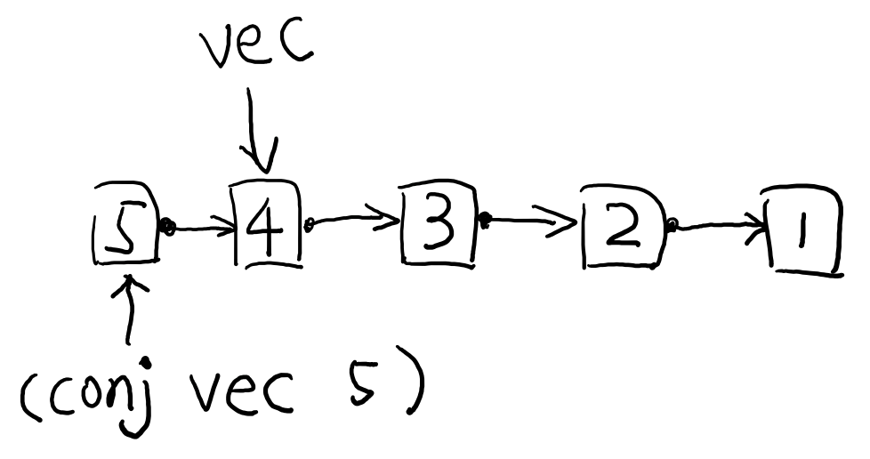
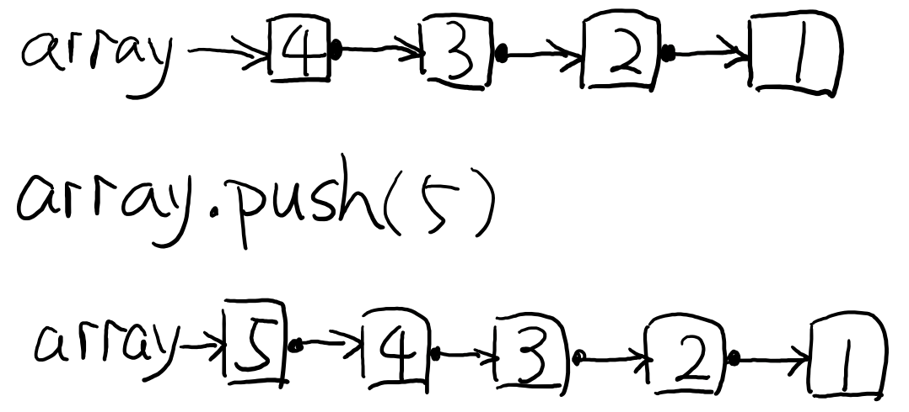
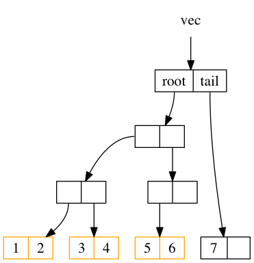
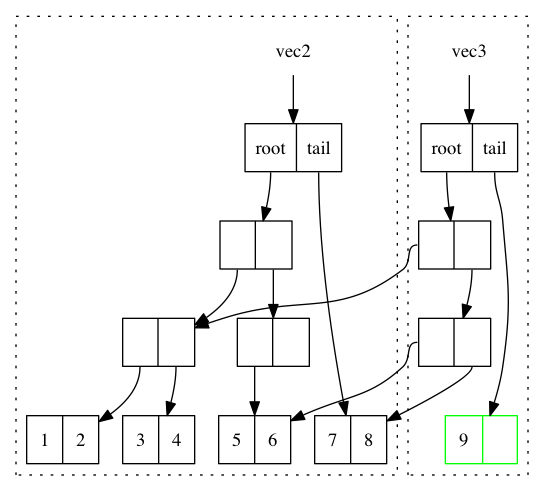
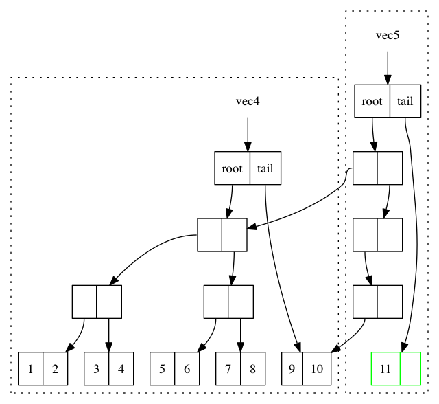
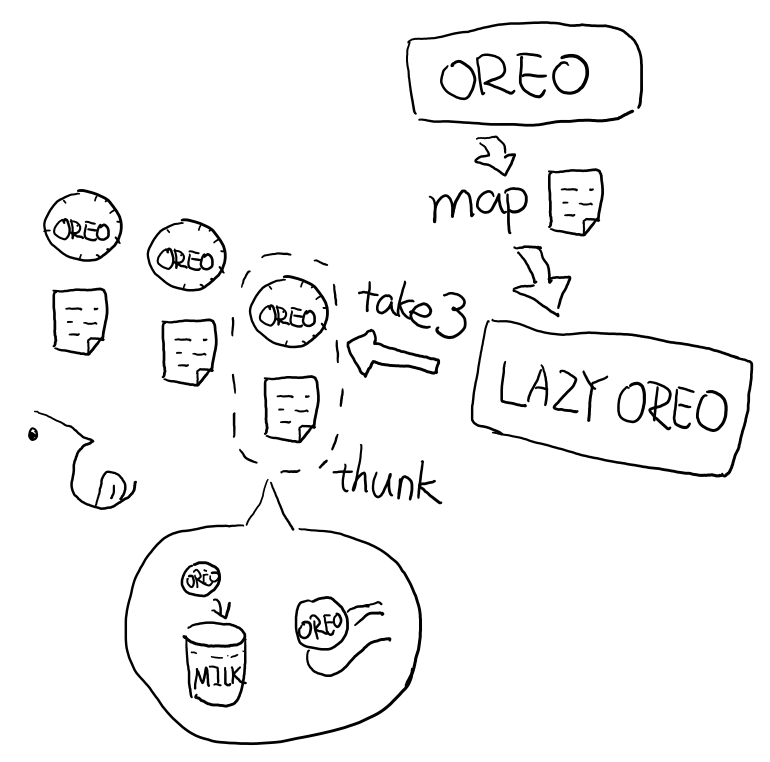

# 3 集合

本章主要介绍 Clojure 的集合数据结构。这是个无聊但是又很重要的章节, 可以说函数式编程最基本最重要的就是集合操作。本章会介绍：

1. 一些集合类型
2. 如何操作集合
3. 什么是以及为什么要惰性求值
4. 如何在 JavaScript 中使用 Clojure 的数据结构

当然，已经熟悉 Clojure 的读者自然可以略过本章。

上一章大致提到了 JavaScript 的数据结构都是可变的数据结构。也就是说一些操作会改变数据结构中的数据内容。当然 JavaScript 原生的 Number 和 String 本身就是不可变的，而且不会有太多的操作，所以本章主要是介绍 **集合** 数据结构。而且，集合也是函数式编程中最常使用的数据结构。

> 本章开始会使用 mori，想在本机使用 mori 非常简单，如果使用 node，只需要 `npm install mori` 然后 `var mori = require('mori')` 引入即可。如果使用浏览器，可以使用 [cdnjs](https://cdnjs.cloudflare.com/ajax/libs/mori/0.3.2/mori.js)。

## 3.1 集合的使用

### 3.1.1 向量（vector）

向量是带有索引（index）的一组数据。跟 JavaScript 的 Array 非常像，但是区别在于

- 向量是不可变（immutable）数据结构
- 向量是持久性（persistent）数据结构

这里两个概念听起来很相似，但是其实有一点点区别。

*不可变* 指的是一旦被创建，就再也不能改变。比如我创建一个向量 Alice，那么不管发生什么，判等 Alice 的话只需要简单的等号，因为 Alice 的内容不可能被改变，所以完全不需要深入判等。

而 *持久性* 是“改变”不可变数据结构的一种方式，每当尝试去修改一个不可变数据结构的时候，其实是建立在旧的数据结构的基础上，做对应的“修改”。本节只会涉及不可变性，下一节会通过介绍向量的持久性数据结构，加深对持久性的认识。

下面我将介绍如何使用向量数据结构，当然，我不是深入细节，只是为了显示不可变数据结构与 JavaScript 原生可变数据结构的区别。

**创建向量**
使用 Clojure 可以字面的（lieral）创建一个向量，或者用 vector 函数，效果都是一样的。

```
[1 2 3 4]
(vector 1 2 3 4)
```

其中，方括号用于字面创建向量，而圆括号表示调用了 `vector` 函数，参数列表为 `1 2 3 4` 。

使用 mori 创建向量也非常的类似：

```
console.log(1+1)
```

```
mori.vector(1,2,3,4)
// => [1 2 3 4]
```

> 从 JavaScript 或其他语言转换 clojure 或 lisp 的语法非常简单，只需要将括号 ( 向左移一个函数名，逗号去掉即可。因此，mori 的 api 则正是这个过程的反转。

如果是在 node 的 repl 中就可以看见类似 Clojure 字面定义 vector 的输出 `[1 2 3 4]` 。

**获取向量中的元素**
通常在 JavaScript Array 中我们获取元素通常会通过 `somearray[0]` 直接用索引获取，当然使用 vector 也非常类似，只不过需要使用 get 方法：

```
var vec = mori.vector(1,2,3,4)
mori.get(vec, 0)
```

当然，为了更符合 JavaScript 的习惯，我们还可以使用 vector 的成员变量 get 获取元素：

```
vec.get(0)
```

**添加元素**
Clojure 中所有集合的添加操作都可以通过 conj 函数，conj全称 conjoin。对于不同数据结构的 conj 操作可能添加的方向是不一样的，但不管怎么样，conj 都会选择最容易的添加(即复杂度最低)的方向添加数据。而在向量数据结构中，conj 的方向是往尾部添加元素：

```
mori.conj(vec, 5) //=> [1 2 3 4 5]
vec // => [1 2 3 4]
```

这很像 JavaScript Array 的 push 方法，但是值得注意的是，push （以及其他数组操作）是一个可变操作（mutation operation），也就是说，push 会改变 Array 中的数据。

```
var array = [1,2,3,4]
array.push(5) // => 5
array // => [1,2,3,4,5]
```

注意看 push 的返回值是添加的数据，而 push 之后的 array 变化成添加过的数据的数组了。

**弹出元素**
弹出元素跟 Array 一样都是使用 pop，当然，由于几乎所有的 clojure 的数据结构都是不可变的，弹出也不例外。所以弹出会返回一个新的“删除”尾部元素的向量，而原来的向量保持不变：

```
mori.pop(vec) //=> [1 2 3]
vec // => [1 2 3 4]
```

**首个元素及剩余元素**
另外在函数式编程中，特别是递归的时候，经常会把列表分为首元素，和剩余（rest）元素集合。

```
mori.first(vec) //=> 1
mori.rest(vec) // => (2 3 4)
```

注意看 rest 返回的是圆括号，为什么变成圆括号了呢？我会在最后一节做详细的解释。

**获取子向量（subvec）**
subvec 操作返回一个持久性的子向量，比如：

```
mori.subvec(vec, 1) // => [2 3 4]
mori.subvec(vec, 1, 2) //=> [2]
vec // [1 2 3 4]
```

> *看到这里，可能细心的读者会发现向量的所有操作都是不可变的，不管如何操作该向量，用于会返回一个新的向量而不是修改原有向量。这样每次都返回一个新的数据结构，听起来像是又拷贝了一份再做操作，效率不是会很低吗？这个问题会在下节解释持久性数据结构的时候得到解答。*

### 3.1.2 Map

虽然想只介绍 vector 就好了，但是 ES6 的把 Map 纳入了标准，这里顺便介绍一下 Map 对应的 Clojure 的数据结构好了。在 Map 还没有被所有浏览器厂商实现之前，绝大多数情况下我们在写 JavaScript 时会使用 Object 来当做 Map 使用。当然，到底是使用 Map 还是 Object 并不是本书的重点，不管是 Map 还是 Object，重点是他们仍然是可变的。

```
var map = new Map();
map.set(0, "零"); // => {0:"零"}
map.set(1, "壹"); // => {0:"零",1:"壹"}
```

map 实例的内容在不同的地方值有可能发生改变。同样的，Clojure 提供不可变的 Map 数据结构，hash-map。同样的，我们都可以通过 mori 在 JavaScript 中使用到 Clojure 的 hash-map。

我们可以简单的使用 mori.hashMap 创建一个 ClojureScript 的 hashmap 实例，当然，所有操作都不会改变原来的不可变对象。

```
var m0 = mori.hashMap("零", 0, "壹", 1);
// => {"零" 0, "壹" 1}

mori.get(m0, "零"); // => 0

var m1 = mori.assoc(m0, mori.vector(1,2), 2);
// m1 = {"零" 0, "壹" 1, [1 2] 2}
m0 // => {"零" 0, "壹" 1}

mori.get(m1, m.vector(1,2)); // => 2
```

m0 永远是 m0。 其中 `mori.assoc` 是更新操作，有意思的是，assoc 操作也同样可以用在 vector 上。

```
mori.assoc(mori.vector(1,2,3),1,8) // => [1 8 3]
```

跟 vector 一样，也可以用 conj 操作连接 hash map:

```
mori.conj(m0, mori.vector("foo", "bar")) // => {"零" 0, "壹" 1, "foo" "bar"}
```

## 3.2 函数组合子
借用函数组合子这个词来代表集合上的一些通用方法，如 map, filter, reduce。更详细的组合子定义可以在 stackoverflow 上找到非常好的解释。先不用去管具体定义，下面我会简单列举一些函数式编程，特别是 Clojure 编程中经常会使用到的一些函数组合子。

### 3.2.1 map

map 把参数中的函数应用到集合中每一个元素上，并返回函数返回的元素组成的新集合。 比如要把一包奥利奥变成馅被舔掉的奥利奥：

```
mori.map(lip, oreoPack)
```

这样产生一包里面都是没有馅的奥利奥。

如果 oreoPack 是一个 JavaScript Array，同样可以直接使用 Array 的 map 组合子：

```
oreoPack.map(lip)
```

似乎后者更符合我们的阅读习惯，不过我会在下一章解释什么情况更适合哪种情况。 但在本章我会一直使用 Clojure 的组合子使用习惯。

### 3.2.2 filter

filter 接收一个谓词函数（predicate function），用于判断哪些元素应该保留，哪些应该被剔除掉。谓词函数顾名思义就是用作谓词的函数，谓词自然应该就是“是”，“等于”，“大于”，“属于”之类的词。

```
mori.filter(mori.isEven, [1,2,3,4,5]);
// => (2 4)
```

同样的，Array 也有 filter 方法：

```
[1,2,3,4,5].filter(x=>x%2==0);
```

### 3.2.3 reduce

前面都是集合内容的转换，而使用 reduce 则方便的可以将集合规约成值，比如我们很容易的可以用 reduce 些一个 sum 函数：

```
mori.reduce((a,b)=>a+b, 0, [1,2,3,4,5])
// => 15
```

其中，第一个函数描述如何进行规约，第二个函数是规约的初始值，最后是集合。

### 3.2.4 flattern

用以把嵌套的集合展平：

```
var v = mori.toClj([[1, 2], 3, [4], [[5, 6], 7]]);
mori.flatten(v); // => (1 2 3 4 5 6 7)
```

### 3.2.5 take

take 会经常用于从一个惰性的集合中取出一部分集合，比如：

```
var s = mori.range(); //  无限序列

mori.take(10, s); // => (0 1 2 3 4 5 6 7 8 9)
```

注意 s 是从 0 开始的无限整数序列，当使用 take 取出前 10 个是，会得到包含着前10个整数的序列。更多关于惰性的话题会在第5节继续。

### 3.2.6 groupBy

groupBy 根据提供的函数的结果来分区，产生相同结果的元素会被分到一个区：

```
mori.partitionBy(x=>x%2==0?'event':'odd', [1,2,3,4,5])
// => {"even" (2 4) "odd" (1 3 5)}
```

## 3.3 持久性数据结构
大概对集合中的向量与 hashMap，以及集合的常用组合子 简单的做了介绍，应该还记得介绍向量时提到的效率问题吗？我们来以向量为例，深入研究一下向量的数据结构到底是怎样的，又是如何做到持久性和不可变性，同时还保证效率的？

首先在解释向量的数据结构之前，我想再普及一下什么是持久性数据结构和不可变性。

持久性是指数据结构在被操作的时候永远保持着前一版本，这种保存之前结构的行为就像是持久化。不可变性是说明不管怎么样，在被创建之后就再也不能改变。所以持久性更像是数据结构的实现，而不可变性约束的数据结构的操作。好了，概念的东西就说到这，我们来举个例子，

还是前面那个例子，假设数组和向量的数据结构都是链表。

那么，如果我要往中添加一项：



图5  持久化数据的增加操作



图6  非持久化数据的增加

> 前方高能预警，一大波 Clojure 源代码来袭。

### 3.3.1 向量的持久性数据结构

当然，Clojure 的向量数据结构并不是简单的链表，而是 Rich Hickey 发明的树形数据结构。官方文档也提到了向量的所有操作的复杂度都是 O(log32N)，但为什么是32呢。回忆一下二分查找是多少，log2N，而二分查找类似于一颗平衡二叉树，那么猜想 log32N 复杂度应该是一个32叉的平衡树才对。

好吧，偷看了一眼源代码，确实证明这个猜想是对的。

```
Node(AtomicReference<Thread> edit){
  this.edit = edit;
  this.array = new Object[32];
}
```

通过这个结构体明显确定是每一个节点有 32 叉的树型结构。我们继续往下看我们关心的问题：如何持久化的？

源代码一直往下翻直到 217 行，会看到 cons 方法，而且这是 IPersistentVector 接口里的方法，这应该就是添加元素了。

```
 1: public PersistentVector cons(Object val){
 2:         int i = cnt
 3:         if(cnt - tailoff() < 32) // <= 1
 4:                 {
 5:                 Object[] newTail = new Object[tail.length + 1];
 6:                 System.arraycopy(tail, 0, newTail, 0, tail.length);
 7:                 newTail[tail.length] = val;
 8:                 return new PersistentVector(meta(), cnt + 1, shift, root, newTail);
 9:                 }
10:         //full tail, push into tree
11:         Node newroot;
12:         Node tailnode = new Node(root.edit,tail);
13:         int newshift = shift;
14:         //overflow root?
15:         if((cnt >>> 5) > (1 << shift)) // <= 2
16:                 {
17:                 newroot = new Node(root.edit);
18:                 newroot.array[0] = root;
19:                 newroot.array[1] = newPath(root.edit,shift, tailnode);
20:                 newshift += 5;
21:                 }
22:         else  // <= 3
23:                 newroot = pushTail(shift, root, tailnode);
24:         return new PersistentVector(meta(), cnt + 1, newshift, newroot, new Object[]{val});
25: }
```

很明显这段代码里有三个分支，不要着急，我们一个一个看一下：

1. 可以看到 第3行 中的 cnt 应该就是当前向量的长度，tailoff 往前找一下会发现是抹掉二进制后五位，也就是除掉最后一片叶子的大小。所以，这个分支是处理当最后一片叶子不完整时的情况。如果是二叉树的话，就是非满二叉树的情况。

2. 如果不满足 1 自然就是子树的叶子都是满的情况，但是满叶子的情况又分两种，如果是比完全树多一片满的叶子，再加一个叶子就溢出了。

3. 剩下是没有溢出的情况。



图7  tailoff 的区域

下面我们再仔细看看如何处理这三种情况。

### 3.3.2 最后一片叶子不完整

这种情况是第一个分支, 一共才 4 行代码，我们不妨仔细读读。

```
1: Object[] newTail = new Object[tail.length + 1]; // <= 1
2: System.arraycopy(tail, 0, newTail, 0, tail.length); // <= 2
3: newTail[tail.length] = val; // <= 3
4: return new PersistentVector(meta(), cnt + 1, shift, root, newTail); // <= 4
```

> System.arraycopy 的 API 是：

> 
```
public static void arraycopy(Object src, //拷贝源
             int srcPos, // 拷贝开始的索引
             Object dest, // 拷贝目标地址
             int destPos, // 目标起始索引
             int length) // 拷贝长度
```

1. 创建一个比尾部多1的对象数组 `newTail`
2. 拷贝尾叶子数组到新创建的对象数组 `newTail`
3. 最后一个元素赋值为需要添加的值
4. 最后一步很重要，创建一个新的 `PersistentVector` 并把 `tail` 设置成 `newTail`
所以以下列代码为例，我们很容易想象这种情况下添加元素的过程。

> *注意，由于画32叉树实在是太长了太难看了，因此这里我画成二叉树，只是为了表示如何插入元素的过程。当然读者应该不介意把它“脑补”成32叉的吧。*

```
var vec = mori.vector(1,2,3,4,5,6,7)
var vec2 = mori.conj(vec, 8)
```


图8  向 vec 添加新元素 8
细心的读者会发现，新的 `vec2.root` 还是指向旧的 `vec.root` ，只是 `vec2.tail` 为 `vec1.tail` 的拷贝再加上新的元素而已。这个操作应该是 O(1) 才对。没有错，这种情况下添加元素确实效率是 O(1)。但是再想想， `vec2 `不像是一颗连贯的树啊，tail 指到了一个完全分离的数组拷贝上。

带着问题我们继续来看如果我再 conj 一个元素会发生什么？

```
var vec3 = mori.conj(vec2, 9)
```

### 3.3.3 所有叶子完整且叶子个数不大于完全树的叶子个数

这时就会进入到这个分支了，现在 `vec2` 的所有叶子都满了，按正常的思路我们需要创建一个新的叶子节点来放我们的新元素 7。我们来看看 Clojure 是怎么做的：

```
1: Node newroot;
2:       Node tailnode = new Node(root.edit,tail); //
3:       int newshift = shift; //
4:       ...
5:       newroot = pushTail(shift, root, tailnode); //
6: return new PersistentVector(meta(), cnt + 1, newshift, newroot, new Object[]{val}) //
```

也只有四行代码，我们来仔细读一下：

1. 第2行 创建一个节点，节点的数组指向当前的 tail，也就是 vec2.tail
2. 第3行 不是很重要，表示二进制移多少位，对应到树里面就是可以判断当前在树的第几层
3. 第5行的 pushTail 非常关键，如果你继续看 pushTail 的实现的话，大致意思就是从 vec2.root开始克隆 tail 一侧的节点，直到最后指向 tailnode 节点。
4. 最后一行没有什么好解释的，vec3.tail 指向只包含7的新数组。



图9  在满叶子的情况下添加元素9
这时候我们再添加 10：

```
var vec4 = mori.conj(vec3, 10)
```

应该还是第一种情况，有叶子不满，那么我们再添加 11 会怎么样呢？

```
var vec5 = mori.conj(vec4, 11)
```

### 3.3.4 所有叶子完整且叶子个数大于完全树的叶子个数

如果是向量元素总数大于一颗完全树的所有叶子，而且所有叶子是完整的，那再往 vec4中添加元素就是这种情况了。

```
newroot = new Node(root.edit);
newroot.array[0] = root; // <= 1
newroot.array[1] = newPath(root.edit,shift, tailnode); // <= 2
newshift += 5; // <= 3
return new PersistentVector(meta(), cnt + 1, newshift, newroot, new Object[]{val}); // <= 4
```

这种情况下代码也不太多，需要看的也就是四行代码：

1. 创建一个新的节点，左子树指向 vec4.root
2. 第二颗子树为新创建的 path，path 直通到 vec4.tail
3. 树的高度加1
4. vec5.tail指向新的对象数组，vec5.root 指向 1 创建的新的节点



图10  添加11

好了，看到这里，我们已经看到了 Clojure 的向量数据结构完整的添加元素的过程。我们可以看到整个过程并没有做全部数据的拷贝，而只是最多 log32N次，也就是树的高度次的拷贝。总体来说复杂度应该是非常可观的，因为一个 6 层的 32 叉树已经能存放 10亿（1,073,741,824）个元素了，而10亿个元素的添加操作最多也只是 O(6*32)，效率是非常不错的。

既然学会了看 Clojure 的源码，下来更新元素和弹出元素的过程可以留给读者研究了。类似的，效率也是O(log32N)。

## 3.4 不可变性
在函数式世界里，所有东西在被创建出来之后都应该是不可变的，换句话说，如果我泡了一杯茶，那这杯茶会一直在那里，不对变多，也不会变少，也不会变成牛奶。所以这杯茶在任何时候，都应该恒等于它被创建时的状态。

### 3.4.1 致命魔术

> 本小节严重剧透，好奇心强的读者请看完电影再回来接着看。

如果你看过克里斯托弗·诺兰的电影《致命魔术》（The Prestige），应该会对里面的安吉尔用特斯拉给的神秘装置复制自己来完成瞬间移动的魔术。虽然安吉尔不停的杀死自己确实做法极端，但是完全又印证了片中开头和结束解释的变魔术的三个步骤：

1. 让你看一个小鸟
2. 让小鸟 “消失”
3. 再把小鸟变 “回来” （这也是最难的步骤）
注意到“消失”和“回来”我都加了引号，因为小鸟是真的“消失”，而”回来“的其实是另一只几乎一样的小鸟。


图11  电影《致命魔术》海报
回到我们的话题上来，那么可变操作就像是让小鸟消失再回来，其实永远都找不回来消失的那只小鸟了。

```
var magic = function(cage){
  cage[0] = {name:‘翠花’}
}
var birdInACage = [{name:’tweety’}]
magic(birdInACage)
birdInACage// => [{name:‘翠花’}]
```

可以看到，经过 magic 函数后，tweety 就消失了，笼子里只有翠花，而这只被 magic 变没有的 tweety，不久之后会被 javascript 的 GC(垃圾回收)铲走。

但是，函数式编程并不喜欢魔术，就像博登在台上把小鸟“变回来”时，台下的小朋友哭着说我要原来那只小鸟一样。函数式编程希望不论何时都可以找回来原来那只小鸟。

因此，我们需要一种神奇的模式把 twetty 隐藏起来。

```
var anotherBirdInTheCage = magic(birdInACage)
function magic(birdInCage){
  return birdInCage.map(function(bird){return bird.name='翠花'})
}
anotherBirdInTheCage// => [{name:‘翠花’}]
birdInACage // => [{name:'tweety'}]
```

太好了，twetty 没有“消失”，只是多了一只叫做翠花的小鸟。

虽然可变性 给我们编程带来了一些便利，这可能是因为我们的真实世界的所有东西都是可变的，这非常符合我们真实环境的思维方式。但是，这种可变性也能带来类似现实世界一样不可预测性的问题，有可能在不经意间会给我带来一些困扰，而却很难推理产生这种困扰的原因。

### 3.4.2 推理（reason about）

由于所有的对象都是可变的，就像现实世界一样，对象之间靠消息通信，而通过各种消息发来发去之后谁也不知道在某一时间这些对象的状态都是些什么。然而对象的行为又可能依赖于其他对象的状态。这样依赖，如果想推测一个对象某个时间的行为，可能需要先确定其所有有消息通信相关的对象这时的状态。

写过前端 JavaScript 的人都应该非常清楚前端代码是非常难推理的，光看一段代码片段很难推测出其行为。通常，自由变量越多，行为越不确定，而前端的 自由变量太多太多：

1. DOM：不管是谁都可以修改
2. 全局变量：谁都可以该
3. Event：事件绑定了一些函数，大部分事件函数一般都是有副作用的
4. Persistent Data：比如 localStorage, cookie 之类的，谁都可以修改

而通常 JavaScript 或前端一些框架，都或多或少的依赖于这些因素。

有意思的是的 ReactJS 就相对更容易推理。因为它使用了单向数据流状态机模型，VirtualDOM 的使用很好的隔离开了 DOM 的状态。React 的成功也充分的诠释了面向对象和函数式编程的完美结合。正常一个 React 控件是这样工作的：


图12  React 控件隔离变化

所以，React 的模型为更高内聚的模型，只有当自己的属性和状态发生变化时，才会重新的返回该状态和属性下的 全新 控件。注意是全新的，不同于传统的修改 DOM 的可变性模型，React 的任何操作都是返回全新控件的不可变操作，就像操作 vector 一样，不会去修改，而是再建一个新的。而且，React 把所有可变的部分都隔离了，所有的可变的因素如，用户事件，数据变化，其他上下游控件的影响，都隔离在状态和属性之外。这样做使得我们的控件行为更简单，容易推理，也容易测试。就像接受两个参数（状态，属性）的函数，给定这两个参数 ，那么返回的控件一定是一样的。而可变的 DOM，也被 VirtualDOM 隔离了。所以完全可以把所有 React 的控件编写的像纯函数一样。因此，也可以像纯函数一样轻松的把一个组件替换掉，轻松解耦了组件之间的关系。

### 3.4.3 线程不安全

前端 JavaScript 虽然说是单线程的，但是基于事件循环的并发模型一样会遇到多线程的线程安全问题。线程不安全是指一个值会被多个线程中的操作同时修改。带来的问题是你很难预测以及重现这个值在某个时间到底是什么。 解决线程安全通常会用到互斥锁，原子操作等等，这些方式大大的增加编程和测试的难度。

在前端即使没有多线程同样会遇到一样的问题，比如在期望线程安全的一个事物操作中，某个值突然被修改了：

```
// 假设收钱比如使用第三方支付宝之类的， 这里假设100ms之后知道支付成功，然后调用回调函数
function charge(order,callback){
  setTimeout(callback.bind(this,order), 100)
}
// 假设熊孩子喝牛奶只需要99ms（可能熊孩子是闪电侠）
function drinkMilkThenChange(order){
  setTimeout(order.push({name:'R2D2',price:99999}),
  99)
}
// 打印发票
function printReceipt(order){console.log(order)}
// 熊孩子买了两个东西
var order = [{name:'kindle',price:99}, {name:'drone', price:299}];
// 熊孩子结账
charge(order, printReceipt)
// 熊孩子喝了杯牛奶后过来修改订单
drinkMilkThenChange(order)
// 这时熊孩子发票上有三个东西
// [{name:'kindle',price:99}, {name:'drone', price:299}, {name: 'R2D2', 99999}]
```

这里到底发生了什么？单线程也不安全吗？难道要给 order 加锁吗？ 这里的 setTimeout 都是写死的多少秒，如果是真实代码多几个熊孩子而且发 ajax 请求不确定回调时间之类的，你永远猜不到最后打印出来的发票上有些什么。

首先，让我来解释一下这里到底发生了什么。使用多线程的思路的话，charge 应该是个 io 操作，通常需要 fork 一个线程来做，这样就不阻塞主线程。于是 printReceipt 就是运行在 fork 出来的另一个线程，意味着我在主线程的操作修改到了子线程依赖的值，导致了线程不安全。

但是 JavaScript 在单线程的运行环境下如何做到线程不安全？单线程，说的是 JavaScript 运行的主线程，但是浏览器可以有若干线程处理这样的 IO 操作，也就是维护传说中的 事件循环 。就拿刚才简单的 setTimeout 为例，其实是另一个线程在100毫秒之后把回调函数放入到事件循环的队列中。

所以解决方式是加锁吗？ 在每次收钱之前，把订单锁上：

```
function charge(order,callback){
  Object.freeze(order);
  setTimeout(callback.bind(this,order), 100)
}
drinkMilkThenChange(order)
// Uncaught TypeError: Cannot assign to read only property 'length' of [object Array]
```

当然加锁可以解决，但是更容易而且无需考虑是多线程的方式则是简单的使用不可变数据结构。简单的把 order 的类型改成 vector 就可以了：

```
function charge(order,callback){
  setTimeout(callback.bind(this,order), 100)
}
function drinkMilkThenChange(order){
  setTimeout(mori.conj(order,{name:'R2D2',price:99999}),
  99)
}
var order = mori.vector({name:'kindle',price:99}, {name:'drone', price:299})
function printReceipt(order){console.log(order.toString())}
charge(order, printReceipt)
drinkMilkThenChange(order)
// [#js {:name "kindle", :price 99} #js {:name "drone", :price 299}]
```

不可变性保证了不管是主线程代码还是回调函数，拿到的值都能一直保持不变，所以不再需要关心会出现线程安全问题。

## 3.5 惰性序列
还记得介绍向量时这个怪怪的返回吗？

```
mori.rest(vec) // => (2 3 4)
```

我明明是取一个向量的尾部，为什么返回的不是方括号的向量，而是圆括号呢？

这个圆括号代表惰性序列（lazy sequence），当然，我接着要来定义 惰性 和 序列 。

这一章既介绍了集合 API 又读了 Clojure 源代码，实在是太无聊了，我自己都快写不下去了，所以我们不妨先暂停一下，来一个十分生动的故事稍微提提神。

### 3.5.1 改良吃奥利奥法

还是吃奥利奥这件事情，如果你已经忘了，我们来回顾一下之前的吃法：

1. 掰成两片，一片是不带馅的，一份是带馅的
2. 带馅的一半沾一下牛奶
3. 舔掉馅
4. 合起来吃掉

这是吃一个奥利奥的方法，我要把这个步骤写下来（这个故事的设定是我的记忆力极差，不写下来我会忘了该怎么吃）。既然学过 map 函数，我们试试要怎么将我的吃法 map 到一整包奥利奥上。首先封装一下如何吃一个奥利奥的步骤：

```
function lipMiddle(oreo){
  var wetOreo = dipMilk(oreo);
  var [top, ...middleBottom] = wetOreo;
  var bottom = lip(middleBottom);
  return [top, bottom];
}
eat(lipMiddle(oreo));
```

然后我们开始吃整包奥利奥（underscore 版吃法）：

```
var _ = require('underscore')
var oreoPack = _.range(10).map(function(x){return ["top","middle","bottom"]})
var wetOreoPack = _.map(oreoPack,lipMiddle);
_.each(wetOreoPack, eat)
```

1. 按照吃奥利奥步骤，我挨个舔掉一整包奥利奥的馅，然后放回袋子里
2. 一个一个吃掉舔过的湿湿的奥利奥

问题是，我其实并不知道自己能不能吃完整包，但是按照这种吃法的话， 我会打开并且着急的把所有奥利奥都沾了下牛奶，把馅舔掉，又塞回了袋子里。

假如我吃了两块就发现吃不下去了，我把袋子封好，然后困得不行去睡觉了。过了两天打开袋子发现我的奥利奥全发霉了。于是开始抱怨为什么当初不吃的要手贱去沾一下牛奶，太浪费了不是吗。

我是个特别抠门的人，于是开始苦思冥想到底吃奥利奥的方式哪里有问题。

很明显我不应该贪心的先吃掉整包奥利奥的馅，我应该吃多少就舔多少奥利奥的馅。但是问题是，我怎么知道我要吃多少呢？

又经过一番又一番的苦思冥想，我终于想到了在不知道能吃多少块的情况下怎样完美的吃一包奥利奥（mori 版吃法）：

1. 把吃的步骤写成10长小条（假设一包有十块奥利奥）
2. 把小条依次贴到每块奥利奥上
3. 待吃的时候每拿出来一个，按照奥利奥上的小条的步骤开始吃
4. 完美！

写成代码该是长这样的：

```
var oreoPack = mori.repeat(["top","middle","bottom"]);
var wetOreoPack = mori.map(lipMiddle,oreoPack);// (ref:)
// 条都塞好了，现在该吃了，假设我吃3块
mori.each(eat,  mori.take(3, wetOreoPack));//(ref:)
```

故事就这么圆满的结束了！于是公主和王子……

等等，这个实现怎么看着跟前面 underscore 的实现没有什么两样，到底是在哪里把小条塞进去的？

### 3.5.2 惰性求值 VS 及早求值

那么现在我们来看看 mori 是如何把小条塞进去的。在这之前，我们再来看看 underscore 版本的实现，细心的读者会发现我还没有实现 lip 函数，这个函数具体如何去舔奥利奥我们并不是很关心，暂且简单的打印出来点东西好了：

```
function lip(oreo){
  console.log("舔了一下")
  return oreo
}
function dipMilk(orea){
  console.log("沾一下牛奶")
  return oreo
}
```

那么， map 我的吃奥利奥方式到整包奥利奥的时候会发生什么呢？

```
var wetOreoPack = _.map(oreoPack,lipMiddle);
// => " 沾一下牛奶" “舔了一下” 这两句话被打印10次
```

而同样的 mori 版本的 map 却什么也不会打印出来：

```
var wetOreoPack = mori.map(lipMiddle,oreoPack) // 无打印信息
```

为什么会什么都没打印，难道没 map 上吗？当然不是，map 是成功的，但是 mori 的 map 不会真对每一块奥利奥都执行我的吃奥利奥流程 lipMiddle，它只会在奥利奥上贴上一张描述如何吃奥利奥的流程的小条。因此，什么也不会返回，相当于我把整包奥利奥打开，贴上小条，再放回原位，封好袋子。



图13  惰性吃奥利奥法

好了，生动的故事真的要圆满结束了，如果这个故事都听明白了的话，再加上几个学术名词，我想我已经解释完什么是惰性和为什么要使用惰性了。故事中的小条，叫做 thunk （我在第一章提过），而这种贴过条的序列，叫做 惰性序列 ，对应的 map 操作方式，叫 惰性求值 。 Underscore 的这种立即执行的 map 方式，叫做 及早求值 。

### 3.5.3 惰性求值的实现

在了解这一大堆名词之后，我们来进一步研究如何具体实现一个惰性的数据结构。我将继续以吃奥利奥为例子，解释如何实现这个惰性的 map。

之前见到的 `mori.map(lipMiddle,oreoPack)` 没有打印出任何信息，按照我的例子的说法是因为“map 只把操作的过程写成小条贴到饼干上”。那么，具体是如何把过程贴到这包奥利奥里的呢？

只要是涉及到实现，我必然要贴源代码，因为没有什么文档会比代码更真实。首先我们大眼看一下 map 的实现：

```
 1: ([f coll]
 2:    (lazy-seq  ;; <= 1
 3:     (when-let [s (seq coll)]
 4:       (if (chunked-seq? s)  ;; <= 2
 5:         (let [c (chunk-first s)  
 6:               size (int (count c))
 7:               b (chunk-buffer size)]
 8:           (dotimes [i size]
 9:               (chunk-append b (f (.nth c i))))
10:           (chunk-cons (chunk b) (map f (chunk-rest s))))
11:         (cons (f (first s)) (map f (rest s))))))) ;; <= 3
```

1. 第2行中的 lazy-seq 的 macro，其实就是用来 new 一个新的 LazySeq 实例（源码在往上翻几页，在658行）
2. 第一个分支处理 chunked-seq 类型的序列，返回一个包含两个元素的序列 `(chunk b)` 和 `(map f (chunk-rest s))`
3. 另外一个分支则处理普通序列，可以看出来返回一个包含两个元素的序列 `(f (first s))` 和 `(map f (rest s))`

两种分支其实返回的都差不多，都是两个元素， 而第二个元素都是递归的再次调用 `map` 。我们先别看第一个分支，看看第二个简单分支。重要的是，所有的过程都放在一个叫 `lazy-seq` 的 macro 中。如果我们把 `(map lipMiddle oreoPack)` 代换展开的话会得到：

```
(lazy-seq (cons (lipMiddle (first oreoPack) (map lipMiddle (rest oreoPack)))))
```

其中 `lazy-seq` 做的事情就是阻止 `(cons...) `被求值，把序列从 应用序 变成 正则序 。回到我们的例子，这样一来， `map` 其实就是创建了一个 `lazy-seq` 的对象或者容器，容器内的序列其实还没有被求值。所以在 `map `之后不会有任何的打印信息，因为所有的东西其实都还没有被求值，也就是我例子中说的，只是给奥利奥贴上了写满过程的小条而已。 这个例子中，就是在吃奥利奥的时候，我们才真正需要进行这么一个吃奥利奥的过程。所以当我从一包奥利奥中拿一个准备吃的时候，我需要安装条上的过程操作一遍：

```
(take 1 (map lipMiddle oreoPack))
```

那么 lazy-seq 中的序列会被求值，意味着，两个元素都会被求值

```
(cons lipedOreo (map lipMiddle (rest oreoPack))))
```

`(lipMiddle (first oreoPack)` 求值得到 `lipedOreo` 而 `(map lipMiddle (rest oreoPack)` 求值变成又一个 `lazy-seq`

```
(lazy-seq (cons (lipMiddle (first (rest oreoPack))) (map lipMiddle (rest (rest oreoPack)))))
```

以此类推，需要吃第二块奥利奥时，同样的再对上式 `lazy-seq` 容器中的序列求值。

好了，生动的故事真的要圆满结束了，如果这个故事都听明白了的话，再加上几个学术名词，我想我已经解释完什么是惰性和为什么要使用惰性了。故事中的小条，叫做 thunk （我在第一章提过），而这种贴过条的序列，叫做 惰性序列 ，对应的 map 操作方式，叫 惰性求值 。 Underscore 的这种立即执行的 map 方式，叫做 *及早求值* 。