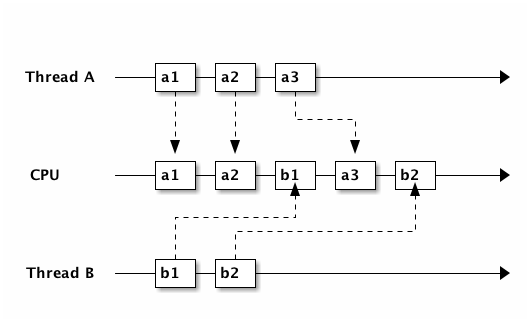
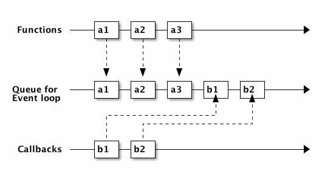
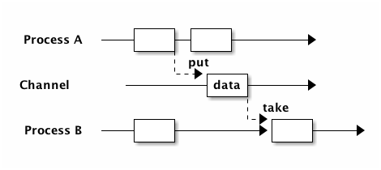

# 4 并发编程

并发编程一直是令人头疼的编程方式，直到 Clojure 和 Go 的出现，彻底改变了我们并发编程的方式。而对于单线程的 JavaScript，基于事件循环的 并发模型也一直困扰着我们，到底能从 Clojure 学些什么，可以使我们的前端 并发编程之路更顺畅一些呢？本章将带你熟悉：

1. 什么是并发？
2. JavaScript 的并发模型。
3. CSP 并发模型。
4. 前端实践中如何使用 CSP。

## 4.1 什么是并发
在介绍 CSP 之前首先有两个概念需要强调一下，那就是并发与并行。 为了便于理解，我会结合现实生活举一个例子。

假设我正在上班写代码，老板过来拍着肩膀说明天要发布，加个班吧。于是我发个短信给老婆说晚点回，发完以后继续敲代码。那么请问，发短信和敲代码两个任务是 **并发** 还是并行 ？

但如果我还特别喜欢音乐，所以我边听音乐边敲代码，那么写代码和听音乐两个任务是并发还是 **并行** ？

为了不侮辱读者的智商，我就不公布答案了。所以说：

- 并发是为了解决如何管理需要同时运行的多个任务。就例子来说就是我要决定的是到底先发短信，还是先写代码，还是写两行代码，发两个字短信呢？对于计算机来说，也就是线程管理。
- 并行是要解决如何让多个任务同时运行。例子中的我享受音乐与写代码所用到的大脑区域可能并不冲突，因此可以让它们同时运行。对于计算机来说，就需要多个 CPU（核）或者集群来实现并行计算。
并行与并发的最大区别就是后者任务之间是互相阻塞的，任务不能同时进行，因此在执行一个任务时就得阻塞另外一个任务。

### 4.1.1 异步与多线程

所以说到并发，如果不是系统编程，我们大多关心的只是多线程并发编程。因为进程调度是需要操作系统更关心的事情。

继续敲代码这个例子，假如我现在能 fork 出来一只手发来短信，但是我还是只有一个脑袋，在发短信的时候我的脑子还是只能集中在 如何编一个理由向老婆请假，而另外两只手只能放在键盘上什么也干不了，直到短信发出去，才能继续写代码。

所以多线程开销大至需要长出（fork）一只手，结束后缩回去（join），但是这 些代价并没有带来时间上的好处，发短信时其它两只手其实是闲置(阻塞)着的。



图14  线程任务到达 CPU 的不确定顺序

因此，另外一种更省资源的处理并发的方式就出现了——异步编程，或者叫 *事件驱动模型* 。对的，就是我们在 JavaScript 代码里经常发的 Ajax 那个异步。

比如我还是两只手，我发完短信继续就敲代码了，这时，老婆给我回了一条短信，那我放下手中的活，拿起手机看看，老牌居然说了“同意”，于是就安心的放下手机继续敲代码了。

注意这段动作与之前多线程的区别，相对于多线程的场景下 fork 了第三只手在敲代码时一直呆呆的握着手机，异步编程并不需要增加胳膊，资源利用率更高一些。

那么你就要问了，你是怎么知道手机响的，还不是要开一个线程让耳朵监听着。对的，但是异步只需要很少的有限个线程就好了。比如我有十个手机 要发给十个老婆，我还是两个线程，相比如果是多线程的话我要 fork 出来十只手，却是会省了不少的资源的。

所以 JavaScript 的并发模型就是这么实现的，有一个专门 的事件循环（[event loop](https://developer.mozilla.org/zh-CN/docs/Web/JavaScript/Guide/EventLoop)）线程，就如同我们的耳朵，不停的检查消息队列中是否还有待执行的任务。

### 4.1.2 JavaScript 的并发模型

JavaScript 的并发模型主要基于事件循环，运行 JavaScript 代码其实就是从 event loop 里面取任务，队列中任务的来源为函数调用栈与事件绑定。

- 每写一个函数 `f() `，都会被加到消息队列中，运行该任务直到调用栈全部弹空。
- 而像 `setTimeout(somefunction,0)` 其实是 注册一个事件句柄（event handler）， timer 会在“0毫秒”后“立刻”往队列加入 `somefunction` (如果不是 0，则是 n 长时间后加入队列)



图15  callback 会加到消息队列末尾

```
function a(){
  console.log('a');
}
function b(){
  console.log('b');
}
function timeout(){
  console.log('timeout');
}
setTimeout(timeout,0);
a();
b();
// => "a"
// => "b"
// => "timeout"
```

这个例子中的 `timeout` 函数并没有在 `a` 或 `b` 之前被调用，因为当时的消息队列应该是这样的(处理顺序从左至右)


现在，我们可以用的并发模型来再实现一下我们最开始的加班写代码的例子：

```
  let keepDoing = (something, interval) => {
    return setInterval(()=>console.log(something), interval);
  };
  let notify = function(read, callback, yesno){
    console.log('dinglingling')
    setTimeout(read.bind(callback), 2000)

  };
  let meSendingText = function(callback) {
    console.log('Me sending text');
    notify(wifeReadingText, callback)
  }
  let wifeReadingText = function(callback){
    console.log('my wife sending text');
    notify(callback, null, 'yes')
  };

  let working = keepDoing('typing',1000);
  let meReadingText = function(msg) {
    if(msg!='ok') clearInterval(work);
    console.log('I\'m reading text');
  }

  meSendingText((msg)=>{
if(msg!='ok') clearInterval(work);
else
    console.log('continue working');
});
```

其中 `notify` 负责往事件循环上放一个任务，当老婆读了短信，并 `notify` 我读回信之后，两秒后短信发到了我的手机上，手机（包含快来阅读短信句柄）的铃声通过我的耳朵传到我的脑回路中，触发我开始读短信。

使用事件循环回调的形式看起来还挺高效的，而且 JavaScript 编程中我们也一直也是这么用的。但是当异步调用多了之后，就会出现 *回调地狱* （Callback Hell）的现象，为什么说是 **地狱** 呢, 可以想象一下前面例子中如果我有十个老婆，要向 五个老婆发短信申请加班，而且都同意后才能继续工作，该是如何实现呢？ #+INDEX 回调地狱

```
meSendingText(wife1Reading, (msg)=>{
    if(msg=='yes')
        metSendingText(wife2Reading, (msg)=>{
            if(msg=='yes')
                metSendingText(wife3Reading, (msg)=>{
                    if(msg=='yes')
                        metSendingText(wife4Reading, (msg)=>{
                            if(msg=='yes')
                                metSendingText(wife5Reading, (msg)=>{
                                    if(msg=='yes')
                                        console.log('continue working')
                                })
                        })
                })  
        })
})
```

只要有一个异步函数要回调，那么所有依赖于这个异步函数结束的函数都得放到该函数的回调内。这是个比地狱还要深的回调地狱。 于是前段时间特别火的 Promise，似乎能够缓解一下回调地狱的窘境。但是，Promise 并不是专门用来消除回调地狱的，Promise 更有意义的应该是在于 Monadic 编程。对于回调地狱，Promise 能做的也只是把这些回调平铺开而已。

> 从乘坐手扶电梯下回调地狱，变成了乘坐直梯下回调地狱。

```
meSendingText(wife1Reading)
    .then(()=>meSendingText(wife2Reading))
    .then(()=>meSendingText(wife3Reading))
    .then(()=>meSendingText(wife4Reading))
    .then(()=>meSendingText(wife5Reading))
```

当然，如果是使用 Monadic 编程方式来解决这种问题的话，其实也可以变得非常优雅而且函数式，读者可以尝试用 when 实现一下（请回到第七章，如果你忘了 when 是什么）。

但是本章，我要强调的是一种更有意思的异步编程方式 CSP。

## 4.2 通信顺序进程（CSP）
通信顺序进程（Communicating Sequential Processes）， 是计算机科学中用于一种描述并发系统中交互的形式语言，简称 CSP，来源于C.A.R Hoare 1978年的论文。没错了，Hoare就是发明（让我们熟悉的大学算法课纠结得快要挂科的） 快排算法的那位计算机科学家了。

CSP 由于最近 Go 语言的兴起突然复活，[Go](http://talks.golang.org/2012/concurrency.slide#1) 给自己的 CSP 实现起名叫 goroutines and channels 25，由于实在是太好用了，Clojure 也加入了 CSP 的阵营，弄了一个包叫做 core.async 。

CSP 的概念非常简单, 想象一下事件循环，类似的：

1. CSP 把这个事件循环的消息队列转换成一个数据队列，并且把这个队列叫做 channel
2. 任务等待队列中的数据



图17  CSP 中的 Channel

这样就成功的把任务和异步数据成功从回调地狱中分离开来。还是刚才发短信的例子，我们来用 CSP 实现一遍：

```
(def working (chan))
(def texting (chan))

(defn boss-yelling []
  (go-loop [no 1]
    (<! (timeout 1000))
    (>! working (str "bose say: work " no))
    (recur (+ no 1))))

(defn wife-texting []
  (go-loop []
    (<! (timeout 4000))
    (>! texting "wife say: come home!")
    (recur)))

(defn reading-text []
  (go-loop []
    (println (<! texting) "me: ignore")
    (recur)))

(defn work []
  (go-loop []
    (println (<! working) " me: working")
    (recur)))

(boss-yelling)
(wife-texting)
(work)
(reading-text)
```

[JS Bin](http://jsbin.com/muliva/2/embed?console)
- 可以看出 boss yelling，wife texting，me working 和 reading text 四个任务是 **并发** 进行的
- 所有任务都相互没有依赖，之间完全没有 callback，没有哪个任务是另一个任务的 callback。 而且他们都只依赖于` working` 和 `texting` 这两个channel
- 其中的` go-loop` 神奇的地方是，它循环获取channel中的数据，当队列空时，它的状态会变成 parking，并没有阻塞线程，而是保存当前状态，继续去试另一个` go `语句。
- 拿 `work` 来说， `(<! texting)` 就是从 channel texting 中取数据，如果 texting 为空，则parking
- 而对于任务 `wife-texting `， `(>! texting "wife say: come home!")` 是往 channel texting 中加数据，如果 channel 已满，则也切到 parking 状态。

## 4.3 使用 generator 实现 CSP
在看明白了 Clojure 是如何使用 channel 来解耦我的问题后，再回过头来看 JavaScript 如何实现类似的 CSP 编程呢？

先理一下我们都要实现些什么：

- go block：当然是需要这样的个block，只有在这个 block 内我们可以自如的切换状态。
- channel：用来存放消息
- timeout：一个特殊的 channel，在规定时间内关闭
- take (<!)：尝试 take channel 的一条消息的动作会决定下一个状态会是什么。
- put (>!)：同样的，往 channe 中发消息，也会决定下一个状态是什么。

当然，首先要实现的当然是最重要的 go block，但是在这之前，让我们看看实现 go block 的前提 ES6 的一个的新标准—— generator 。

### 4.3.1 Generator

[ES6 终于支持了Generator](http://blog.dev/javascript/essential-ecmascript6.html#sec-9)，目前Firefox与Chrome都已经实现。27 Generator 在每次被调用时返回 `yield` 后边表达式的值，并保存状态，下次调用时继续运行。

这种功能听起来刚好符合上例中神奇的 parking 的行为，于是，我们可以试试用 generator 来实现刚刚 Clojure 的 CSP 版本。

### 4.3.2 Go Block

go block 其实就是一个状态机，generator 为状态机的输入，根据不同的输入使得状态机状态转移。所以实现 go block 其实就是：

- 一个函数
- 可以接受一个 generator
- 如果 generator 没有下一步，则结束
- 如果该步的返回值状态为 park，那么就是什么也不做, 过一会继续尝试新的输入
- 如果为 continue，就接着去 generator 取下一输入

```
function go_(machine, step) {
  while(!step.done) {
    var arr   = step.value(),
        state = arr[0],
        value = arr[1];
    switch (state) {
      case "park":
        setTimeout(function() { go_(machine, step); },0);
        return;
      case "continue":
        step = machine.next(value);
        break;
    }
  }
}

function go(machine) {
  var gen = machine();
  go_(gen, gen.next());
}
```

### 4.3.3 timeout

timeout 是一个类似于 thread sleep 的功能，想让任务能等待个一段时间再执行， 只需要在 `go_ `中加入一个 timeout 的 `case` 就好了。

```
...
  case 'timeout':
    setTimeout(function(){ go_(machine, machine.next());}, value);
    return;
...
```

如果状态是 timeout，那么等待 `value` 那么长的时间再继续运行 generator。

另外，当然还需要一个返回 timeout channel 的函数：

```
function timeout(interval){
  var chan = [interval];
  chan.name = 'timeout';
  return chan;
}
```

每次使用 timeout 都会生成一个新的 channel，但是 channel 内只有一个消息，就是 timeout 的 毫秒数。

### 4.3.4 take <!

当 generator 从 channel 中 take 数据时的状态转移如下：

- 如果 channel 空，状态变为 park
- 如果 channel 非空，获得数据, 状态改成 continue
- 如果是 timeout channel，状态置成 timeout

```
function take(chan) {
  return function() {
    if(chan.name === 'timeout'){
      return ['timeout', chan.pop()];
    }else if(chan.length === 0) {
      return ["park", null];
    } else {
      var val = chan.pop();
      return ["continue", val];
    }
  };
}
```

### 4.3.5 put >!

当 generator 往 channel 中 put 消息

- 如果 channel 空，则将消息放入，状态变为 continue
- 如果 channel 非空，则进入 parking 状态

```
function put(chan, val) {
  return function() {
    if(chan.length === 0) {
      chan.unshift(val);
      return ["continue", null];
    } else {
      return ["park", null];
    }
  };
}
```

### 4.3.6 JavaScript CSP 版本的例子

有了 go block 这个状态机以及使他状态转移表之后，终于可以原原本本的将之前的 clojure 的例子翻译成 JavaScript 了。

```
function boss_yelling(){
  go(function*(){
    for(var i=0;;i++){
      yield take(timeout(1000));
      yield put(work, "boss say: work "+i);
    }
  });
}

function wife_texting(){
  go(function*(){
    for(;;){
      yield take(timeout(4000));
      yield put(text, "wife say: come home");
    }
  });
}

function working(){
  go(function*(){
    for(;;){
      var task = yield take(work);
      console.log(task, "me working");
    }
  });
}

function texting(){
  go(function*(){
    for(;;){
      var read = yield take(text);
      console.log(read, "me ignoring");
    }
  });
}
boss_yelling();
wife_texting();
working();
texting();
```

是不是决定跟 Clojure 的例子非常相似呢？注意每一次 yield 都是操作 go block 这个状态机，因此就这个例子来说，我们可以跟踪一下它的状态转移过程，这样可能会对这个简单的 go block 状态机有更深得理解。

1. 首先看 `boss_yelling` 这个 go 状态机，当操作为 `take(timeout(1000))` 时，状态会切换到 `timeout` 这样状态机会停一个 1000 毫秒。
2. 其他的状态机会继续运行，接下来应该就到 `wife_texting` ，同样的这个状态机也会停 4000秒
3. 现在轮到 `working` ，但是 work channel 中并没有任何的消息，所以也进入 parking 状态。
4. 同样 `texting` 状态机也进入 parking 状态。

直到 1000 毫秒后， `boss_yelling` timeout

1. `bose_yelling` 状态机继续运行，往 work channel 中放了一条消息。
2. `working` 状态机得以继续运行，打印消息。
此时没有别的状态机的状态可以变化，又过了 1000 毫秒， `working` 还会继续打印，直到第 4000 毫秒， `wife_texting` timeout，状态机继续运行，往 text channel 添加了一条消息。这时状态机 `texting` 的状态才从 parking 切到 continue，开始打印消息。

以此类推，就会得到这样的结果：

```
"boss say: work 0"
"me working"
"boss say: work 1"
"me working"
"boss say: work 2"
"me working"
"boss say: work 3"
"me working"
"boss say: work 4"
"me working"
"wife say: come home"
"me ignoring"
"boss say: work 5"
"me working"
...
```

## 4.4 在前端实践中使用 CSP
之前的实验性的代码只是为了说明 CSP 的原理和实现思路之一，更切合实际的，我们可以通过一些库来使用到 Clojure 的 core.async。这里我简单的介绍一下我从 ClojureScript 的 core.async 移植过来的 conjs。

### 4.4.1 使用移植的 core.async

由于 go block 在 Clojure 中是用 macro 生成状态机来实现的，要移植过来困难不小，因此这里我只将 core.async 的 channel 移植了过来，但是是以接受回调函数的方式。

```
const _ = require('con.js');
const {async} = _;
var c1 = async.chan()
var c2 = async.chan()

async.doAlts(function(v) {
  console.log(v.get(0)); // => c1
  console.log(_.equals(c1, v.get(1))) // => true
},[c1,c2]);

async.put$(c1, 'c1');
async.put$(c2, 'c2');
```

有意思的是，我顺带实现了 Promise 版本的 core.async，会比回调要稍微更方便一些。

```
async.alts([c1,c2])
  .then((v) => {
console.log(v.get(0)); // => c1
  console.log(_.equals(c1, v.get(1))) // => true
  })
async.put(c1, 'c1').then(_=>{console.log('put c1 into c1')})
async.put(c2, 'c2').then(_=>{console.log('put c2 into c2')})
```

虽然把 channel 能移植过来，但是缺少 macro 原生支持的 JavaScript 似乎对 go block 也无能为力，除非能有 generator 的支持。

### 4.4.2 使用 ES7 中的异步函数

由于在实践中我们经常会使用到 babel 来将 ES6 规范的代码编译成 ES5 的代码。所以顺便可以将 ES7 的开关打开，这样我们就可以使用 ES7 规范中的一个新特性—— async 函数。 使用 async 函数实现我们之前的例子估计代码并不会有大的变化，让我们使用 async 函数和 channel 实现一下 go 经典的乒乓球小例子。

```
 1: let _ = require('con.js');
 2: let {async} = _;
 3: 
 4: async function player(name, table) {
 5:   while (true) {
 6:     var ball = await table.take();
 7:     ball.hits += 1;
 8:     console.log(name + " " + ball.hits);
 9:     await async.timeout(100).take();
10:     table.put(ball);
11:   }
12: }
13: 
14: (async function () {
15:   var table = async.chan();
16: 
17:   player("ping", table);
18:   player("pong", table);
19: 
20:   await table.put({hits: 0});
21:   await async.timeout(1000).take();
22:   table.close();
23: })();
```

当把球` {hist:0}` 放到 `table` channel 上的时候，阻塞在第6行` take` 的 player ping 会先接到球，player ping 击完球 100ms 之后，球又回到了 `table `channel。之后 player pong 之间来回击球知道 table 在 1000ms 后被关闭。

所以我们运行代码后看到的间断性的 100ms 的打印出：

```
pong 1
ping 2
pong 3
ping 4
pong 5
ping 6
pong 7
ping 8
pong 9
ping 10
pong 11
ping 12
```

通过 async/await，结合 conjs 的 channel， 真正让我们写出了 Clojure core.async 风格的代码。利用 CSP 异步编程的方式，我们可以用同步的思路，去编写实际运行时异步的代码。这样做不仅让我们的代码更好推理，更符合简单的命令式思维方式，也更容易 debug 和做异常处理。