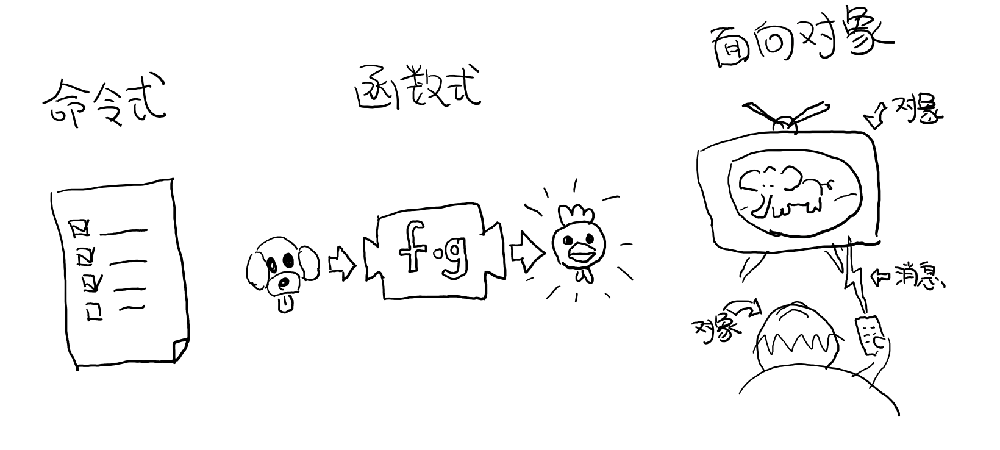
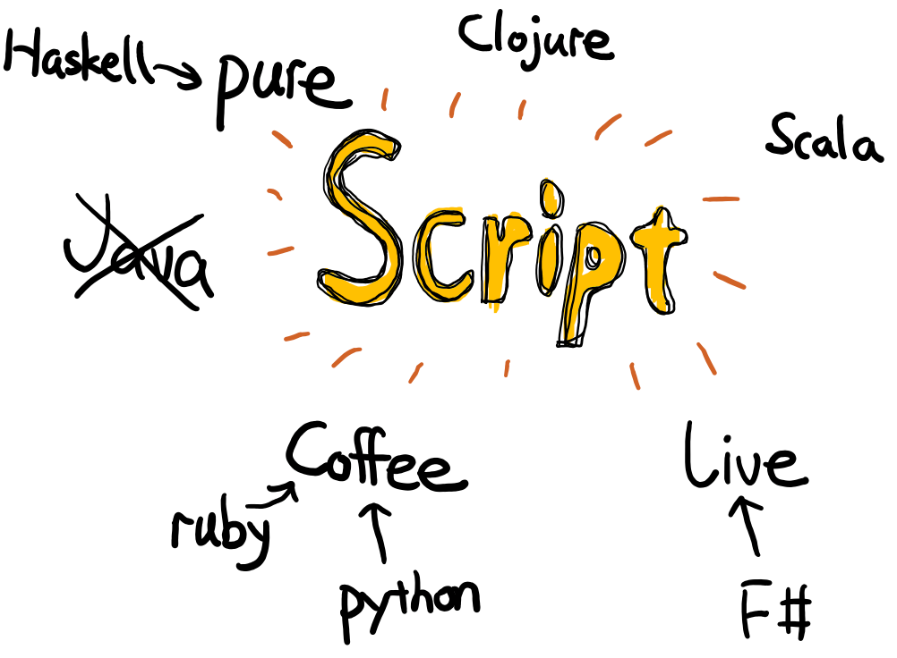

# 2 函数式 javascript

本章将介绍 JavaScript 的函数式背景：

1. 为什么说 JavaScript 是函数式语言？
2. 我们为什么要关心函数式编程？
3. 为什么不用 Underscore？
4. 要作为完整的函数式语言，JavaScript 还缺些什么？

## 2.1 最好在看本书之前

### 2.1.1 能看懂 JavaScript 代码

这既不是一本介绍 Clojure 也不是介绍 JavaScript 的书，这是一本介绍如何用 JavaScript 函数式编程的书。其中一些函数式的思想和表现形式都借用了 Clojure，因此叫做 Clojure 风格的函数式 JavaScript，但是并不要求在读本书前会 Clojure，而只需要能阅读 JavaScript 代码，那就足够了。 如果你会 Clojure，可以完全忽略我解释 Clojure 代码的段落，当然 JavaScript 的部分才是重点。

### 2.1.2 你可能买错书了，如果你是

**想学 JavaScript**
这不是一本 JavaScript 的教科书，这里只会介绍如何用 JavaScript 进行函数式编程，所以如果想要系统学习 JavaScript 的话，我猜看一看《JavaScript 语言精粹》已经足够了。另外如果读者的英文好的话，还有一本可以在线免费阅读的[《JavaScript Allonge》](https://leanpub.com/javascriptallongesix/read)。

**想学 Clojure**
同样的，这也不是 Clojure 的教科书，这里只含有一些用于阐述函数式编程思想的 Clojure 代码。作为副作用，你确实可以学到一些 Clojure 编程的知识，但很可能是非常零碎不完整的知识。如果是想要系统的了解和学习 Clojure 的话，非常推荐《The Joy of Clojure》，另外，如果读者英文比较好，还有一本可以免费在线阅读的[《CLOJURE for the BRAVE and TRUE》](http://braveclojure.com/) 也非常的不错。

**函数式编程的专家**
如果你已经在日常工作或学习中使用 Scala，Clojure 或者 Haskell 等函数式语言编程的话，那么本书对你在函数式编程上的帮助不会太大。 **不过：**这本书对解你从函数式语言迁移到 JavaScript 编程的不适应该是非常有效的，当然，这也正是本书的目的之一。

### 2.1.3 准备环境

在开始阅读本书之前，如果你希望能运行书中的代码的话，可能需要一些环境的配置。而且书中的所有源码和运行方式都可以在本书的 Github 仓库中找到。当然如果你使用 emacs（同时还配置了 org babel 的话） 阅读本书的源码的话，对于大部分代码只需要光标放在在代码处按 `c-c c-c `即可。

**JavaScript**
原生的 JavaScript 没有什么好准备的，可以通过 Node 或者 Firefox（推荐）的 Console 运行代码。当然第五章会有一些使用 sweet.js 写的 macro，则需要安装 sweet.js。

**安装 Node/iojs**
1. 下载 [nodejs](https://nodejs.org/)
2. 如果使用 mac，可以直接用 brew 安装

```
brew install node 
# 或者
brew install iojs
```

**安装 sweet.js**
在安装完 node 之后命令行输入：

```
npm install -g sweet.js
```

**Clojure**
书中的 Clojure 代码大多都用来描述函数式编程的概念，当然如果想要运行书中的 Clojure 代码，首先需要安装 [JVM 或者 JDK](http://www.oracle.com/technetwork/java/javase/downloads/index.html)，至少需要 1.6，推荐安装 1.8。

**安装 leiningen**
leiningen 是 clojure 的包管理工具，类似于 node 的 npm，ruby 的 bundle，python 的 pip。 另外 leinigen 还提供脚手架的功能。可以通过[官网](http://leiningen.org/)的脚本安装。 mac 用户可以简单的使用 `brew install leiningen` 安装。

安装完之后，就可以运行 `lein repl` 打开 repl，试试输入下列 clojure 代码，你将会立马看见结果。

```
(+ 1 1)
;=> 2
```

**编辑器**
如果更喜欢使用编辑器用来编辑更长一段的代码，我推荐非 emacs 用户使用 [Light Table](http://lighttable.com/), intellij 用户对使用 [cursive](https://cursive-ide.com/)。当然如果读者已经在使用 Emacs，那就更完美了，emacs [cider mode](https://github.com/clojure-emacs/cider) 是 Clojure 编程不错的选择。

## 2.2 JavaScript 也是函数式语言?
说到 JavaScript 可能第一反应会是一门面向对象的语言。事实上，JavaScript 是基于原型（prototype-based）的 **多范式** 编程语言。也就是说面向对象只是 JavaScript 支持的其中一种范式而已，由于 JavaScript 的函数是一等公民，它也支持函数式编程范式。

### 2.2.1 编程范式

常见的编程范式有三种，命令式，面向对象以及函数式，事实上还有第四种，逻辑式编程。 如我们在大学时学过的 C 语言，就是标准的命令式语言。而如果你在大学自学过 Java 打过黑工的话，那么你对面向对象也再熟悉不过了吧。而可能大部分人（以为）接触函数式的机会比较少，因为它是更接近于数学和代数的一种编程范式。

**命令式**
这恐怕是我们最熟悉的编程范式了(大部分计算机课程都会是 C)，命令式顾名思义就是以一条条命令的方式编程，告诉计算机我需要先做这个任务，然后另一个任务。还有一些控制命令执行过程的流控制，比如我们熟悉的循环语句：

```
for(var i=0;i<10;i++){
  console.log('命令',i)
}
```

当然还有分支语句，switch 等等，都是用来控制命令的执行 *过程* 。

**面向对象**
这恐怕是目前最常见的编程范式了（绝大部分的工程项目的语言都会是面向对象语言）。而面向对象的思想则更接近于现实世界，封装好的对象之间通过消息互相传递信息。面向对象有一些我们熟悉的概念比如封装，继承，多态等等。而面向对象的思维主要是通过抽象成包含状态和一些方法的对象来解决问题，可以通过继承关系复用一些方法和行为。

**函数式**
函数式则更接近于数学，简单来说就是对表达式求值。跟面向对象有所不同的是函数式对问题的抽象方式是抽象成 带有动作的函数。其思维更像是我们小时候解应用题时需要套用各种公式来求解的感觉。当然函数式跟面向对象一样还包含了很多的概念，比如高阶函数，不可变性，惰性求值等等。



图 1  主要的编程范式

**逻辑式编程**
可能这个名词听的比较少，但是我们经常在用而却可呢过没有意识到的 SQL 的 query 语句就是逻辑式编程。所谓逻辑式，就是通过提问找到答案的编程方式。比如：

```
select lastname from someTable where sex='女' and firstname in ('连顺','女神')
```

这里问了两个问题：

1. 性别是女？
2. 名字必须是“连顺”或者“女神”？

那么得到的答案就是符合问题描述的结果集了。

除了最常见的 SQL，Clojure 也提供了 `core.logic` 的库方便进行逻辑式编程。

### 2.2.2 JavaScript 对函数式的原生支持

说了这么多种编程范式，JavaScript 对函数式的支持到底如何呢？

首先如果语言中的函数不是一等的，那么也就跟函数式编程也就基本划清界限了。比如 Java 8 之前的版本，值和对象才是一等公民，要写一个高阶函数可能还需要把函数包在对象中才行。

幸好 JavaScript 中的函数是一等函数，所谓一等，就是说跟值一样都是一等公民，所有值能到的地方，都可以替换成函数。例如，可以跟值一样作为别的函数的参数，可以被别的函数想值一样返回，而这个“别的函数”叫做 *高阶函数* 。

**函数作为参数**
函数作为参数最典型的应用要数 map 了，想必如果没有使用过 Underscore，也或多或少会用过 ECMAScript 5 中 Array 的 map 方法吧。map 简单将一个数组转换为另一个数组。

```
[1, 2, 3, 4].map(function(x) {
  return ++x;
});
```

可以看到函数 `function(x){return x++}` 是作为参数被传入 Array 的 `map `方法中。map 是函数式编程最常见的标志性函数，想想在 ECMAScript 5 出来之前应该怎么做类似的事情：

```
var array = [1, 2, 3, 4];
var result = [];
for(var i in array){
  result.push(++i);
}
```

这段命令式的代码跟利用 map 的函数式代码解决问题的方式和角度是完全不同的。命令式需要操心所有的过程，如何遍历以及如何组织结果数据。而 map 由于将遍历，操作以及结果数据的组织的过程封装至 Array 中，从而参数化了最核心过程。而这里的核心过程就是 map 的参数里的匿名函数中的过程，也是我们真正关心的主要逻辑。

**函数作为返回值**
函数作为返回值的用法可能在 JavaScript 中会更为常见。而且在不同场景下被返回的函数又有着不同的名字。

**柯里化**
我们把一个多参的函数变成一次只能接受一个参数的函数的过程叫做柯里化。如：

```
var curriedSum = curry(sum)
var sum5 = curriedSum(5)
var sum5and4 = sum5(4) //=> 9
sum5and4(3) // => 12
```

当然柯里化这样做的目的非常简单，可以部分的配置函数，然后可以继续使用这些配置过的函数。当然，我会在第四章函数组合那里更详细的解释为什么要柯里化，在这之前闲不住的读者可以先猜猜为什么要把柯里化放函数组合那一章。

**thunk**
thunk（槽）是指有一些操作不被立即执行，也就是说准备好一个函数，但是不执行，默默等待着合适的时候被合适的人调用。我实在想不出能比下图这个玩意更能解释 thunk 的了。 在下一章，你会见到如何用 thunk 实现惰性序列。


图 2  thunk 像是一个封装好待执行的容器

**越来越函数式的 ES6**
ECMAScript 6（也被叫做 ECMAScript 2015，本书中会简称为 ES6）终于正式发布了，新的规范有非常的新特性，其中不少借鉴自其他函数式语言的特性，给 JavaScript 语言添加了不少函数式的新特性。

> 虽然浏览器厂商都还没有完全实现 ES6 的所有规范，但是其实我们是可以通过一些中间编译器使用大部分的 ES6 的新特性，如

> **Babel**

> 这是目前支持 ES6 实现最多的编译器了，没有之一。 主要是 Facebook 在维护，因此也可以编译 Facebook 的 React。这也是目前能实现尾递归优化的唯一编译器。不过关于尾递归只能优化尾子递归，相互递归的优化还没有实现。

> **Traceur**

> Google 出的比较早得一个老牌编译器，支持的 ES6 也不少了。但是从 github 上来看似乎已经没有 babel 活跃了。

> 当然，除了这些也可以直接使用 FireFox。作为 ES6 规范的主要制定者之一的 Mozilla 出的 Firefox 当然也是浏览器中实现 ES6 标准最多的。

**箭头函数**
这是 ES6 发布的一个新特性，虽然 Firefox 支持已久了，不算什么新东西，但是标准化之后还是比较令人激动的。 箭头函数 也被叫做 肥箭头 （fat arrow）9，大致是借鉴自 CoffeeScript 或者 Scala 语言。箭头函数是提供词法作用域的匿名函数。

**声明一个箭头函数**
你可以通过两种方式定义一个箭头函数：

```
([param] [, param]) => {
   statement
}
// 或者
param => expression
```

表达式可以省略块（block）括号，而多行语句则需要用块括号括起来。

**为什么要用箭头函数**
虽然看上去跟以前的匿名函数没有什么区别，我们可以对比旧的匿名函数是如何写一个使数组中数字都乘 2 的函数.

```
var a = [1, 2, 3, 4,5];
a.map(function(x){ return x*2 });
```

而使用箭头函数会变成：

```
a.map(x => x*2);
```

使用箭头函数可以少写 function 和 return 以及块括号，从而让我们其实更关心的转换关系变得更明显。略去没用的长的匿名函数定义其实可以让代码更简洁更可读。特别是在传入高阶函数作为参数的时候， `map(x=>x*2)` 更形象和突出的表达了变换的逻辑。

**词法绑定**
如果你觉得这种简化的语法糖还不足以说服你改变匿名函数的写法，那么想想以前写匿名函数中的经常需要 `var self=this` 的苦恼吧。

```
 1: var Multipler = function(inc){
 2:   this.inc = inc;
 3: }
 4: Multipler.prototype.multiple = function(numbers){
 5:   var self = this; // <=
 6:   return numbers.map(function(number){
 7:     return self.inc * number; // <=
 8:   })
 9: }
10: new Multipler(2).multiple([1,2,3,4]) // => [ 2, 4, 6, 8 ]
```

- 第 5 行保持 Multipler 的 this 引用的缓存
- 第 7 行使用 self 引用 Multipler 的实例而不是 this

这样做很怪不是吗，因此经常出现在各种面试题中，让你猜猜 this 到底是谁。或者让你去修正 this 绑定，方法如此之多，但是不管是使用 EcmaScript 5 的 bind，还是 map 的第三个参数来保证 this 的绑定不会出错，都逃脱不了要手动修正 this 绑定的命运。

那么如果用箭头函数就不会存在这种问题：

```
Multipler.prototype.multiple = function(numbers){
  return numbers.map(number => number*this.inc);
};

new Multipler(2).multiple([1,2,3,4]);// => [ 2, 4, 6, 8 ]
```

现在，箭头函数里面的 this 绑定的是外层函数的 this 值，不会受到运行时上下文的影响。而是从词法上就能轻松确定 this 的绑定。不需要 `var self=this` 了是不是确实方便了许多，不仅不会再被各种怪异的面试题坑了，还让代码更容易推理。

**尾递归优化**
Clojure 能够通过 `recur` 函数对 尾递归 进行优化，但是 ES5 的 JavaScript 实现是不会对尾递归进行任何优化，很容易出现 爆栈 的现象。但是 ES6 的标准已经发布了对尾递归优化的支持，下来我们能做的只是等各大浏览器厂商的实现了。

不过在干等原生实现的同时，我们也可以通过一些中间编译器如 Babel，把 ES6 的代码编译成 ES5 标准 JavaScript，而在 Babel 编译的过程就可以把尾递归优化成循环。

**Destructure**
在解释 Destructure 之前，先举个生动的例子，比如吃在奥利奥的是时候，我的吃法是这样的：

1. 掰成两片，一片是不带馅的，一份是带馅的
2. 带馅的一半沾一下牛奶
3. 舔掉馅
4. 合起来吃掉

如果写成代码，大致应该是这样的：

```
var orea = ["top","middle","bottom"]
var top = orea.shift(),middleAndButton=orea // <1>
var wetMiddleAndButton = dipMilk(middleAndButton) // <2>
var button = lip(wetMiddleAndButton) // <3>
eat([top,button]) // <4>
```

注意那个诡异的 `shift` ，如果用 destructure 会写得稍微优雅一些：

```
var [top, ...middleAndButton] = ["top","middle","bottom"] // <1>
var wetMiddleAndButton = dipMilk(middleAndButton) // <2>
var button = lip(wetMiddleAndButton) // <3>
eat([top,button]) // <4>
```

有没有觉得我掰奥利奥的姿势变酷了许多？这就是 destructure，给定一个特定的模式 `[top, ...middleAndButton] `，让数据` ["top","middle","bottom"]` 按照该模式匹配进来。同样的，我将会专门在第 6 章介绍模式匹配这个概念，虽然它不是 Clojure 的重要概念，但是确实 Scala 或 Haskell 的核心所在。不过可以放心的是，你也不必在此之前先学习 Scala 和 Haskell，我还是会用最流行的 JavaScript 来介绍模式匹配。


图 3  我觉得这个玩具可以特别形象的解释模式匹配这个概念

## 2.3 作为函数式语言 JavaScript 还差些什么
作为多编程范式的语言，原型链支持的当然是面相对象编程，然而却同时支持一等函数的 JavaScript 也给函数式编程带来了无限的可能。之所以说可能是因为 JavaScript 本身对于函数式的支持还是非常局限的，为了让 JavaScript 全面支持函数式编程还需要非常多的第三方库的支持。下面我们来列一列到底 JavaScript 比起纯函数式语言，到底还差些什么？

### 2.3.1 不可变数据结构

首先需要支持的当然是不可变（immutable）数据结构，意味着任何操作都不会改变该数据结构的内容。JavaScript 中除了原始类型其他都是可变的（mutable）。相反，Clojure 的所有数据结构都是不可变的。

> JavaScript 一共有 6 种原始类型（ES6 新加了 Symbol 类型），它们分别是 Boolean，Null，Undefined，Number String 和 Symbol。 除了这些原始类型，其他的都是 Object，而 Object 都是可变的。

比如 JavaScript 的 Array 是可变的：

```
var a = [1,2,3]
a.push(4)
```

`a` 的引用虽然没有变，但是内容确发生了变化。

而 Clojure 的 Vector 类型则行为刚好相反：

```
(def a [1 2 3])
(conj a 4) ;; => [1 2 3 4]
a ;; => [1 2 3]
```

对 `a` 的操作并没有改变 `a` 的内容，而是 `conj` 操作返回 的改变后的新列表。在接下来的第二章你将会看到 Clojure 是如何实现不可变数据结构的。

### 2.3.2 惰性求值

惰性（lazy）指求值的过程并不会立刻发生。比如一些数学题（特别是求极限的）我们可能不需要把所有表达式求值才能得到最终结果，以防在算过程中一些表达式能被消掉。所以惰性求值是相对于及早求值（eager evaluation）的。

比如大部分语言中，参数中的表达式都会被先求值，这也称为 应用序 语言。比如来看下这样个 JavaScript 的函数：

```
wholeNameOf(getFirstName(), getLastName())
```

`getFirstName` 与 `getLastName` 会依次执行，返回值作为 `wholeNameOf` 函数的参数， `wholeNameOf `最后被调用。

另外，对于数组操作时，大部分语言也同样采用的是应用序。

```
map(function(x){return ++x}, [1,2,3,4])
```

所以，这个表达式立刻会返回结果 `[1,2,3,4]` 。

当然这并不是说 Javascript 语言使用应用序有问题，但是没有提供惰性序列的支持就是 JavaScript 的不对了。如果 map 后发现其实我们只需要前 10 个元素时，去计算所有元素就显得是多余的了。

### 2.3.3 函数组合

面向对象通常被比喻为名词，而函数式编程是动词。面向对象抽象的是对象，对于对象的的描述自然是名词。面向对象把所有操作和数据都封装在对象内，通过接受消息做相应的操作。比如，对象 Kitty 和 Pussy，它们可以接受“打招呼”的消息，然后做相应的动作。而函数式的抽象方式刚好相反，是把动作抽象出来，比如就是一个函数“打招呼”，而参数，则是作为数据传入的 Kitty 或者 Pussy，是完全透明的。比如 Kitty 进入函数“打招呼”时，出来的应该是一只 Hello Kitty 。

面向对象可以通过继承和组合在对象之间分享一些行为或者说属性，函数式的思路就是通过 **组合** 已有函数形成一个新的函数。JavaScript 语言虽然支持高阶函数，但是并没有一个原生的利于组合函数产生新函数的方式。关于函数组合的技巧，会在第四章作详细的解释，而这些强大的函数组合方式却往往被类似 underscore 库的光芒掩盖掉。

### 2.3.4 尾递归优化

Clojure 的数据结构都是不可变的，除了使用数据结果本身的方法进行遍历，另外的循环手段自然只能是递归了。但是在没尾递归优化的 JavaScript 中就不会那么愉快了。

在 JavaScript 中可能会经常看到这样的代码：

```
var a = [1,2,3,4]
var b = [4,3,2,1]
for(var i=0;i<10;i++)
 a[i]+=b[i]
console.log(a);
// => [5,5,5,5]
```

如果使用 Clojure 硬要做类似的事情通常只能使用 reduce 解决，代码会变成这样：

```
(loop [a [1 2 3 4] 
       b [4 3 2 1]
       i (dec (len a))]
  (recur (assoc a i (get b i) b (dec i))))
```

recur 看起来跟 for 循环非常类似，其实它是尾递归，如果把 loop 写成一个函数：

```
  (defn zipping-add [a b i]
    (recur (assoc a i (get b i) b (dec i))))
(zipping-add [1 2 3 4] [4 3 2 1] (dec (len a)))
```

事实上效果是一样的，但是如果把 `recur `想象成是 `zipping-add` ，明显能看出 `zipping-add` 是一个尾递归函数。

因此反过来看，若是要把尾递归换成循环是多么容易的一件事情，关键的是需要让解释器识别出来尾递归。

但是这不是 Clojure 的风格，亦不是函数式的风格。递归应该被认为是比较低级别的操作，像这种高级别的操作还是应该优先使用 map，reduce 来解决。

```
(map #(+ %1 %2) [1 2 3 4] [4 3 2 1])
```

Clojure 的 map 是个神奇的函数，若是给多个向量，他做的事情会相当于先 zip 成一个向量，再把向量的元素 apply 到组合子上。这样完全不需要循环和变量，得到了一段不需要循环和变量的简洁的代码。 但是，在写低级别的一些代码的时候，递归还是强有力的武器，而且尾递归优化能带来更好的性能，在第五章我会更详细的介绍不可变数据结构以及递归。

## 2.4 Underscore 你错了
如果提到 JavaScript 的函数式库，可能会联想到 Underscore12。Underscore 的官网解释是这样的：

> Underscore 提供了 100 多个函数，不仅有常见的函数式小助手: map，filter，invoke，还有更多的一些额外的好处……

我就懒得翻译完了，重点是这句话里面的“函数式小助手”，这点我实在不是很同意。

### 2.4.1 跟大家都不一样的 map 函数

比如 map 这个函数式编程中比较常见的函数，我们来看看看 **函数式语言** 中都是怎么做 map 的：

**Clojure：**

```
(map inc [1 2 3])
```

其中 `inc` 是一个给数字加一的函数。 **Haskell：**

```
map (1+) [1,2,3]
```

同样 `(1+)` 是一个函数，可以给数字进行加一操作。

这是非常简单的 map 操作，应用函数 `inc`, `(1+)` 到数组 中的每一个元素。同样的事情我们试试用 Underscore 来实现一下：

```
_.map([1,2,3], function(x){return x+1})
```

感觉到有什么变化了吗？有没有发现参数的顺序完全不同了？好吧，你可能要说这并不是什么问题啊？不就是 map 的 api 设计得不太一样么？也没有必要保持所有的语言的 map 都是一样的吧？

在回答这个问题之前，我想再举几个例子，因为除了 Underscore，JavaScript 的函数式库还有很多很多：

[**ramdajs：**](http://ramdajs.com/)

```
R.map(function(x){return x+1}, [1,2,3])
```

[**functionaljs：**](http://functionaljs.com/)

```
fjs.map(function(x){return x+1}, [1,2,3])
```

应该不需要再多的例子了，不管怎么样看，underscore 的 map 是否都略显另类了呢？跟别的语言不一样就算了，跟其他 JavaScript 的函数式库都不一样的话，是不是有些说不过去了。 我猜 underscore 同学估计现在有种高考出来跟同学对答案，发现自己的答案跟别人的完全不一样的心情。

好吧，Underscore 先别急着认错，大家都这么做，肯定不是偶然。但是原因就说来话长了，我将会在第四章详细解释其他函数式语言/库为什么都跟 Underscore 不一样。

当然我可不会选一个“另类”的库来阐述函数式编程。我将像编程世界中最好的书《计算机程序的构造与解释》一样，我选择用 lisp 语言来阐述函数式编程概念，而用目前最流行的语言 —— JavaScript 来实践函数式。当然我也不会真的用老掉牙的 scheme，因为所有前端开发者都应该知道，前端最唾弃的就是使用久的东西，这样一来 Clojure 这门全新的现代 lisp 方言显然是最好的选择。

### 2.4.2 ClojureScript

Clojure 是跑着 JVM 上的 lisp 方言，而 ClojureScript 是能编译成 JavaScript 的 Clojure。但是请不要把 ClojureScript 与 CoffeeScript，LiveScript，TypeScript 做比较，就像每一行 Clojure 代码不能一一对应到 Java 代码一样，你可能很难像 CoffeeScript 对应 JavaScript 一样能找到 ClojureScript 与其编译出来的 JavaScript 的对应关系。



图 4  各种编译成 JavaScript 的函数式语言

不管怎么样，ClojureScript 把 Clojure 带到了前端确实是非常令人激动的一件事情。就跟前端程序员能在后端写 JavaScript 一样，Clojure 程序员终于能在前端也能找到自己熟悉的编程姿势。但是如同 Clojure 于 Java 的交互一样（或者更坏）， ClojureScript 与 JavaScript 及 JavaScript 的库的交互并不是那么容易，或者可以说，不那么优雅。而且前端开发者可能并不能很快的适应 lisp 语言，项目（特别是开源项目）的维护不能只靠懂 clojure 的少数开发者，所以如果能用最受欢迎的 JavaScript，又还能使用到 Clojure 的所有好处，那将再好不过了。幸运的是，Clojure 的持久性数据结构被 David Nolen 移植到了原生 JavaScript —— [mori](https://github.com/swannodette/mori)。

### 2.4.3 Mori

由于是移植的，所有的数据结构以及操作数据结构的函数都是 ClojureScript 保持一致，而且是作为 JavaScript 库，可以在原生 JavaScript 的代码中使用。显然 mori 是最适合用于前端函数式实践的库，当然也是本书为什么说是 Clojure 风格的函数式 JavaScript 的原因了。

选择 mori 的另一原因是因为它特别区别于其他的函数式库的地方——它使用 ClojureScript 的数据结构。也就是说从根本上消除了 JavaScript 可变的数据结构模型，更利于我们的进行函数式编程。

> 为了保持从风格上更类似于 Clojure，以及迁移 Clojure 中的一些 macro，本书中也使用了我写的一系列的 macro —— [ru-lang](http://ru-lang.org/)。更多的关于 macro 的讨论我会放到第五章。

当然，选择 mori 并不说明它是工程的上函数式类库的最佳选择，facebook 活跃维护的 Immutable.js 也是不错的选择。但是在这里，mori 确实是能将 Clojure 编程思想蔓延到 JavaScript 中的最好桥梁。